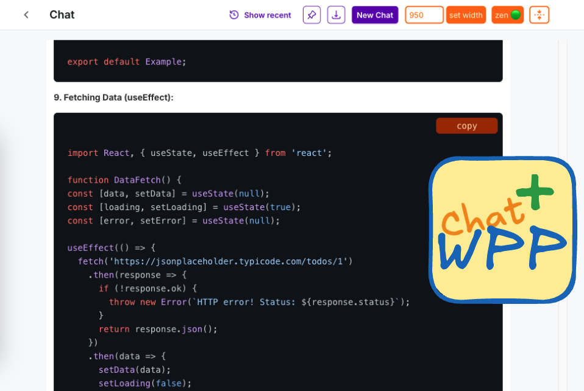

## Chat WPP Plus - WPP Imagine AI Creative Studio Extension
* Syntax Highlighting
* Code Copying
* UI Customizations
	* Custom Chat Width
	* Zen Mode

(scroll down for installation guides 🙂)

### Installation
FOR CHROME & CHROME BASED BROWSERS:
1. download the source code and unzip it
2. go to Extensions tab(`chrome://extensions/`) and enable **Developer mode**
3. Click **Load Unpacked** and choose the folder of the source code

FOR FIREFOX & FIREFOX BASED BROWSERS:
1. download the source code and unzip it
2. go to `about:debugging#/runtime/this-firefox`
3. Click **Load Temporary Add-on...** and choose `manifest.json` file